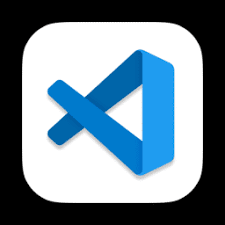
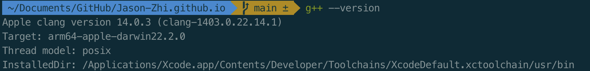
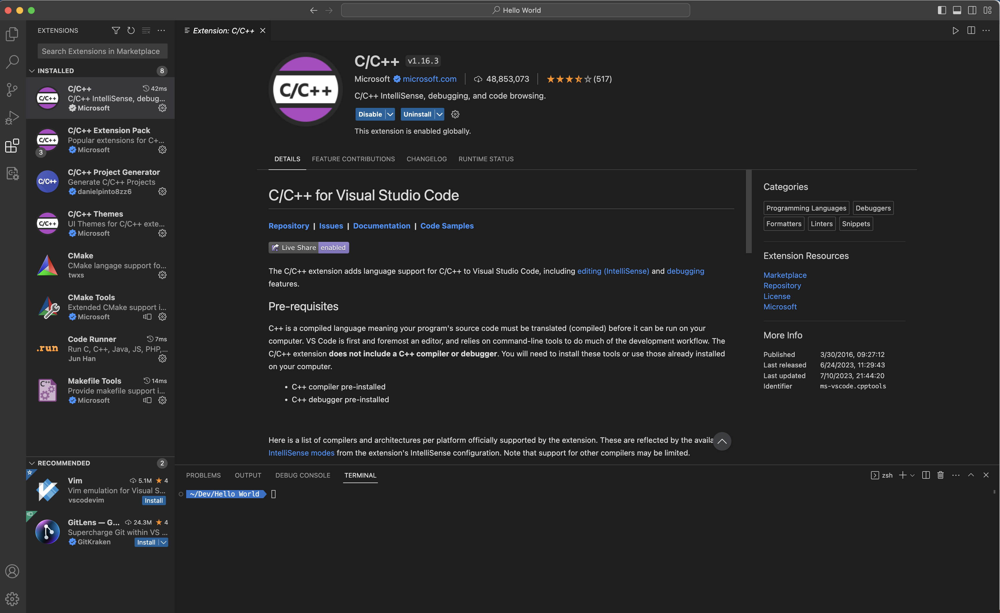

## 如何在MAC上使用VScode来写C++项目




<br>

本文记录了在Mac系统上使用VScode写C++的配置过程。

---

### 1. 下载VScode for Mac

[下载地址](https://code.visualstudio.com/sha/download?build=stable&os=darwin-universal)

<br>

### 2. 配置本地C++编译环境

理论上来说Mac是具备本地的C++编译环境的。在terminal中使用如下命令查看是否安装g++。

```bash
g++ --version
```

<br>

如果结果类似下图，则已安装。



<br>

否则，在终端使用如下命令安装（其实是装了个Xcode...）：

```bash
xcode-select --install
```

<br>

### 3. 在VSCode中安装C++插件



在搜索框中搜索安装下面的两个插件：

* C/C++
* Code Runner

<br>

All set! 
