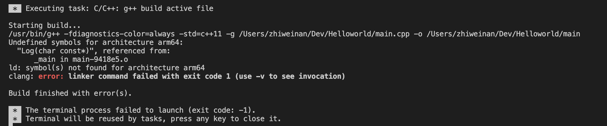

## 在M1/M2 Mac上使用VScode多文件编译C++错误：Undefined symbols for architecture arm64




如果你使用的是M1/M2芯片的Mac，且在VScode上多文件编译C++出现错误`Undefined symbols for architecture arm64`，暂时没有完美的解决方案。临时的解决方案就是在命令行自行编译如下：

```shell
g++ a.cpp b.cpp -o a.out
./a.out
```

<br>

如果你有更好的解决方案，欢迎交流。